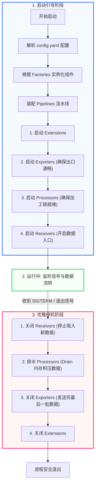

# OpenTelemetry Collector 整体执行流程与架构解析

本文件以生产级 Kubernetes (K8s) 容器环境为背景，通俗易懂地介绍 OpenTelemetry (OTel) Collector 的整体执行流程（包括控制流与数据流），并配有直观的 Mermaid 流程图。

---

## 一、 生产环境实例背景

为了让讲解更具象，我们假设在 K8s 集群中部署了一个 OTel Collector，用于监控一个**电商微服务系统**：
*   **输入端 (Receivers)**：
    *   `otlp` (Push 模式)：监听 4317 端口，接收**订单服务** (Java) 和**支付服务** (Go) 主动推送的 API 调用 Trace (链路追踪) 数据。
    *   `hostmetrics` (Pull 模式)：每 10 秒主动获取运行 Collector 所在 K8s 节点的 CPU/内存使用率指标 (Metrics)。
*   **加工端 (Processors)**：
    *   `memory_limiter`：监控 Collector 自身内存，防止在大流量并发时因内存超限而被系统 OOM (Out of Memory) 强杀。
    *   `batch`：将零散的数据打包，攒够 8192 条或到了 2 秒再统一发送，大幅减少网络请求次数，提升传输效率。
*   **输出端 (Exporters)**：
    *   `otlp/jaeger` (Traces)：将处理后的 Trace 链路数据发送到 Jaeger 后端展示。
    *   `prometheus` (Metrics)：暴露一个 `/metrics` 接口，供 Prometheus 监控系统主动拉取节点指标。

---

## 二、 Collector 进程生命周期控制流 (Startup -> Run -> Shutdown)

Collector 作为一个常驻后台进程，其启动、运行和停止都有严格的控制逻辑。为了确保**“数据不丢失”**，组件的启动和关闭顺序至关重要。

### 1. 启动阶段 (Startup)
当我们在终端执行启动命令或 K8s 启动 Pod 时，程序按照以下步骤引导：
1.  **命令行入口启动**：执行 `main.go`，调用 `otelcol.Command`。
2.  **加载与解析配置**：读取 `config.yaml`。通过核心包 `confmap` 统一解析、填充默认值，并校验配置的合法性。
3.  **构建组件工厂**：在 Factory 注册表中找到对应的实现，并通过 `Create*` 工厂方法（如 `CreateTracesReceiver`、`CreateBatchProcessor` 等）实例化各个组件。
4.  **流水线装配 (Pipeline Building)**：按照配置的 `pipelines` 逻辑，将实例化的 Receiver, Processor, Exporter 穿线组装。
5.  **按序启动链 (Startup Order)**：为了防止 Receiver 提前开始接收数据而下游尚未就绪导致数据堆积或丢失，Collector 严格按照以下顺序启动：
    *   **步骤 A：启动 Extensions**（如健康检查、性能剖析 zPages 等辅助工具）。
    *   **步骤 B：启动 Exporters**（输出端就绪，确保数据有地方发送）。
    *   **步骤 C：启动 Processors**（加工通道就绪，可以处理流经的数据）。
    *   **步骤 D：启动 Receivers**（最后打开数据入口，开始接收/采集数据）。

### 2. 运行阶段 (Running)
所有组件启动完毕，Collector 进入主循环：
*   常驻运行，监听操作系统信号（如 `SIGINT`, `SIGTERM`）。
*   Receivers 持续接收客户端推送的数据，或定时器触发抓取任务。

### 3. 优雅停机阶段 (Shutdown)
当 Collector 升级或重启收到 `SIGTERM` 信号时，为了确保内存中缓存的数据能安全发送到后端，它按照与启动相反的顺序依次关闭：
*   **步骤 A：关闭 Receivers**：首先关闭端口监听，停止定时拉取。此时 Collector 不再接收新数据，但现有连接中的数据会处理完毕。
*   **步骤 B：关闭 Processors**：通知 `batch` 等处理器将当前队列中积压的缓冲数据强行打包发送（这个过程称为 Drain）。
*   **步骤 C：关闭 Exporters**：等待所有 Processor 派发完数据后，关闭 Exporters，断开与后端服务（如 Jaeger）的连接。
*   **步骤 D：关闭 Extensions**：最后关闭辅助扩展插件，进程安全退出。

---

### 生命周期控制流图 (Mermaid)

---

## 三、 数据包的 Collector 奇幻之旅 (Data Flow)

在 Collector 正常运行期间，遥测数据是如何在各个管道中流动的？我们以**订单 Trace** 和**系统 Metric** 两个具体的生产实例来进行剖析。

### 1. 案例一：订单服务 Trace 数据流 (Push 模式)
1.  **用户下单**：用户在前端点击购买，微服务系统的“订单服务”接收请求，并使用 OTel SDK 生成一条 Trace Span 记录。
2.  **推送数据**：订单服务通过 OTLP/gRPC 协议将这条数据发送到 Collector 的 `4317` 端口。
3.  **接收与转换 (Ingest)**：`otlp` Receiver 收到 TCP 数据包，由内部解码器将其从 Protobuf 格式解析，并转换为 Collector 内部的统一强类型数据结构 `ptrace.Traces`。
4.  **安全加工 (Process)**：
    *   数据流向第一个处理器 `memory_limiter`。它检查 Collector 当前内存是否在安全阈值内，如果超载则拒绝服务或丢弃，保护进程不崩溃。
    *   数据流入 `batch` 处理器。它是一个数据缓冲队列，此时订单 Trace 会在内存队列中积压等待。
5.  **批量打包 (Batching)**：一旦队列积压达到 8192 条，或者触发了 2 秒的定时器，`batch` 处理器将数据打包，发送给下一个组件。
6.  **扇出发送 (Export)**：`batch` 将数据投递给绑定的所有输出端（在此处是 `otlp/jaeger` Exporter）。
7.  **协议转换与发送**：`otlp/jaeger` Exporter 将 `ptrace.Traces` 数据转换回 Jaeger 后端能识别的格式，通过网络发送给 Jaeger 服务端，用户便可在 Jaeger UI 上查看到该笔订单的完整调用链。

### 2. 案例二：节点 Metric 数据流 (Pull 模式)
1.  **定时触发**：`hostmetrics` Receiver 内部的 10 秒定时器触发。
2.  **本地拉取**：Receiver 调用操作系统底层接口（如读取 `/proc/stat`），获取当前的 CPU 使用率数值。
3.  **转换指标**：将读取到的原始指标值包装为统一的 `pmetric.Metrics` 数据结构。
4.  **加工流转**：数据直接流向 `batch` 处理器进行排队合并。
5.  **指标暴露**：`prometheus` Exporter 维持着一个本地的 HTTP 服务（例如 `localhost:8889/metrics`），并将加工好的 Metrics 数据以 Prometheus Exposition Format（普罗米修斯文本格式）保存在内存中。
6.  **外部拉取**：Prometheus Server 按照其自身的抓取周期，访问 Collector 的 `/metrics` 接口，拉取并存储 CPU 指标。

---

### 数据包流转图 (Mermaid)

```mermaid
flowchart TD
    %% 电商 Trace 链路 (Push)
    subgraph PushPath ["Trace 数据流 - 订单服务 (主动推送)"]
        A1["订单微服务 OTel SDK"] -->|"OTLP/gRPC 4317 端口"| B1["otlp Receiver"]
        B1 -->|"解析为 ptrace.Traces"| C1["memory_limiter Processor"]
        C1 -->|"内存健康监测"| D1["batch Processor"]
        D1 -->|"攒批打包 8192条 或 2秒"| E1["otlp/jaeger Exporter"]
        E1 -->|"发送给后端"| F1["Jaeger UI 展示"]
    end

    %% 主机 Metrics 链路 (Pull)
    subgraph PullPath ["Metrics 数据流 - 主机监控 (定时拉取)"]
        A2["操作系统内核 /proc/stat"] -->|"10秒定时器抓取"| B2["hostmetrics Receiver"]
        B2 -->|"组装为 pmetric.Metrics"| C2["batch Processor"]
        C2 -->|"攒批处理"| D2["prometheus Exporter"]
        D2 -->|"内存保存符合 Prometheus 规范的数据"| E2["Prometheus Server"]
        E2 -->|"HTTP GET /metrics 拉取"| D2
        E2 -->|"绘图展示"| F2["Grafana Dashboard"]
    end

    %% 样式美化
    style PushPath fill:#fffbf0,stroke:#d4a373,stroke-width:2px;
    style PullPath fill:#f0fbfb,stroke:#00a8a8,stroke-width:2px;
```

