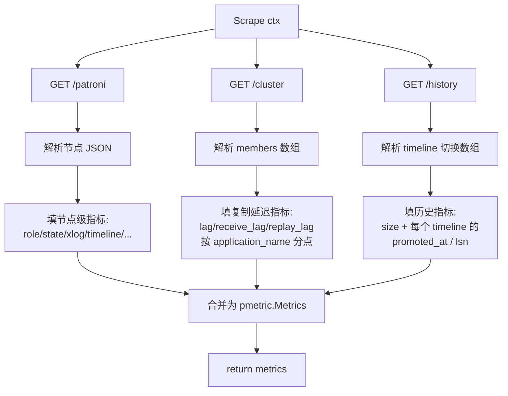

# 构建 Patroni Receiver 开发文档

本文件记录 `otel_col_diy` 项目中 `patronireceiver` 的开发过程与设计决策。它是一个 **Scraper 型 Metrics Receiver**，用于定时拉取 [Patroni](https://github.com/patroni/patroni) 集群的 REST API，将节点 / 集群状态转换为 OpenTelemetry Metrics 并送入 Collector 管道。

> 关联文档：
> * 整体 Collector 架构与生命周期见 [collector_execution_flow.md](../collector_execution_flow.md)
> * Receiver 设计模式与执行流程见 [receiver_execution_flow.md](../receiver_execution_flow.md)
> * 从零搭建一个 trace receiver 的入门教程见 [build_receiver.md](./build_receiver.md)（`tailtracer` 即由此而来）

---

## 一、背景与目标

### 1.1 为什么需要它

Patroni 是 PostgreSQL 的高可用（HA）方案，每个节点运行一个 REST API（默认端口 `8008`），暴露集群拓扑、节点角色、WAL 复制进度、故障保护状态等信息。运维需要把这些状态作为**指标**接入监控告警系统（Prometheus / OTel 后端）。

Patroni 自身已提供 `GET /metrics`（Prometheus 文本格式），但本项目希望以 **原生 OTel Metrics Receiver** 的方式直接采集，避免引入 Prometheus receiver 中转，统一数据模型（`pmetric.Metrics`）。

### 1.2 与 `tailtracer` 的关系

`tailtracer`（见 [build_receiver.md](./build_receiver.md)）是按官方教程搭建的 **trace receiver 骨架**，采用 *Generate* 模式（定时器 + 内存造假数据）。它教会了我们 Receiver 的"四件套"骨架（`Config` / `Factory` / `Start`+`Shutdown` / `ConsumeXxx`），但与真实采集差距很大：

| 维度 | `tailtracer` | `patronireceiver` |
|---|---|---|
| 信号类型 | Traces（`receiver.WithTraces`） | **Metrics**（`receiver.WithMetrics`） |
| 数据来源 | 内存随机生成 | **HTTP GET Patroni REST API** |
| 数据模型 | `ptrace.Traces` | **`pmetric.Metrics`** |
| 触发机制 | 手写 `time.Ticker` | **scraperhelper 控制器**（自动管 ticker / context / 错误） |
| 指标定义 | 无 | **`metadata.yaml` 驱动**（mdatagen 代码生成） |
| Config | `interval` + `number_of_traces` | `endpoint` / `collection_interval` / TLS / auth |
| 错误处理 | 无 | HTTP / JSON 解析 / 超时 / 重试 |

> 结论：**不需要自己实现 Collector**，只实现 Receiver 即可。`tailtracer` 的骨架可复用，核心增量是 ① 信号换 Metrics；② 真实 HTTP scrape；③ scraperhelper 框架；④ metadata 驱动的指标定义。

---

## 二、数据源：Patroni REST API

权威文档：[patroni/docs/rest_api.rst](https://github.com/patroni/patroni/blob/master/docs/rest_api.rst)。本 receiver 主要消费三个端点：

### 2.1 `GET /patroni` — 节点自身状态 JSON

```json
{
  "state": "running",
  "postmaster_start_time": "2024-08-28 19:39:26.352526+00:00",
  "role": "primary",
  "server_version": 160004,
  "xlog": {
    "location": 67395656,
    "received_location": 67419744,
    "replayed_location": 67419744,
    "replayed_timestamp": null,
    "paused": false
  },
  "timeline": 1,
  "replication": [
    { "application_name": "patroni2", "client_addr": "10.89.0.6", "state": "streaming", "sync_state": "async", "sync_priority": 0 }
  ],
  "cluster_unlocked": true,
  "failsafe_mode_is_active": true,
  "pause": true,
  "dcs_last_seen": 1692356928,
  "patroni": { "version": "4.0.0", "scope": "demo", "name": "patroni1" }
}
```

### 2.2 `GET /cluster` — 集群拓扑 + 各 standby 复制延迟

```json
{
  "members": [
    { "name": "patroni1", "role": "leader", "state": "running", "timeline": 5 },
    { "name": "patroni2", "role": "replica", "state": "streaming",
      "receive_lag": 0, "replay_lag": 0, "lag": 0 }
  ],
  "scope": "demo"
}
```

`members[]` 中每个 standby 的 `lag` / `receive_lag` / `replay_lag`（字节）用于复制延迟指标，这是 `/metrics` Prometheus 输出里没有、JSON 独有的信息。

### 2.3 `GET /history` — 集群 timeline 切换历史

返回数组的数组，每条记录代表一次 failover / switchover 导致的提升（timeline 切换）事件，格式为 `[timeline, lsn, reason, promoted_at]`：

```json
[
  [1, 25623960, "no recovery target specified", "2019-09-23T16:57:57+02:00"],
  [2, 25624344, "no recovery target specified", "2019-09-24T09:22:33+02:00"],
  [3, 25624752, "no recovery target specified", "2019-09-24T09:26:15+02:00"],
  [4, 50331856, "no recovery target specified", "2019-09-24T09:35:52+02:00"]
]
```

* `timeline`：切换后的新 timeline 编号。
* `lsn`：提升时刻的 WAL 位置（字节）。
* `reason`：切换原因（通常为 `no recovery target specified`）。
* `promoted_at`：该 timeline 创建时间（ISO8601，需解析为 epoch 秒）。

该端点为集群级数据（集群内各节点返回一致）。从中提取：
* 历史记录总数 → `patroni.history.size`（反映累计切换次数）。
* 每条记录的提升时间 / WAL 位置 → `patroni.history.promoted_at`、`patroni.history.lsn`，以 `patroni.history.timeline` 为属性键，每条历史记录一个数据点。

### 2.4 `GET /metrics` — 命名与语义对齐参考

Patroni 自带的 Prometheus 输出（`patroni_postgres_running`、`patroni_xlog_location`、`patroni_postgres_state` …）是指标命名的权威依据。本 receiver 的 OTel 指标名与之逐一对齐（`.` ↔ `_`），便于与既有 Grafana 面板迁移。

---

## 三、指标与属性设计（`metadata.yaml`）

文件：`patronireceiver/metadata.yaml`。采用 OTel **mdatagen** 代码生成规范，顶层声明 `attributes`，在 `metrics` 中引用。

### 3.1 属性（attributes）

| 属性 | 类型 | 来源 | 说明 |
|---|---|---|---|
| `patroni.scope` | string | `patroni.scope` | 集群 scope |
| `patroni.node.name` | string | `patroni.name` | 节点名 |
| `patroni.role` | string | `role` | `primary` / `replica` / `standby_leader` |
| `patroni.state` | string | `state` | 文本状态（`running`…） |
| `patroni.version` | string | `patroni.version` | Patroni 版本 |
| `patroni.replication.application_name` | string | `replication[].application_name` | standby 名 |
| `patroni.replication.client_addr` | string | `replication[].client_addr` | standby IP |
| `patroni.replication.sync_state` | string | `replication[].sync_state` | `async`/`sync`/`quorum` |
| `patroni.history.timeline` | int | `/history[][0]` | 历史记录对应的 timeline 编号 |
| `patroni.history.reason` | string | `/history[][2]` | timeline 切换原因 |

### 3.2 指标（metrics）

按 OTel 语义分三类（命名与 Patroni `/metrics` 一一对应）：

**0/1 布尔 Gauge**（`gauge: int`，属性 `scope` + `node.name`；`patroni.postgres.running` 额外携带 `patroni.role`）：
`patroni.postgres.running`、`patroni.primary`、`patroni.replica`、`patroni.standby_leader`、`patroni.sync_standby`、`patroni.quorum_standby`、`patroni.postgres.streaming`、`patroni.postgres.in_archive_recovery`、`patroni.cluster.unlocked`、`patroni.failsafe_mode.active`、`patroni.xlog.paused`、`patroni.pending_restart`、`patroni.is_paused`。

**数值 Gauge**：
* `patroni.postgres.state`（int，0–14，附 `patroni.role` + `patroni.state` 文本属性；数值固定不变）
* `patroni.version`（int，如 `040000`；同时携带 `patroni.version` 文本属性以便 Grafana 展示原始版本号）
* `patroni.postgres.server_version`（int）
* `patroni.postmaster_start_time`（double，epoch 秒）
* `patroni.xlog.replayed_timestamp`（double，epoch 秒）
* `patroni.dcs_last_seen`（int，epoch 秒）

**单调递增 Counter**（`sum: int, monotonic: true, cumulative`）：
`patroni.xlog.location`、`patroni.xlog.received_location`、`patroni.xlog.replayed_location`（单位 `By`）、`patroni.postgres.timeline`。

**复制延迟 Gauge**（来自 `/cluster`，属性含 `patroni.replication.application_name` + `client_addr` + `sync_state`）：
`patroni.replication.lag`、`patroni.replication.receive_lag`、`patroni.replication.replay_lag`（单位 `By`）。

**集群历史 Gauge**（来自 `/history`，每次 timeline 切换一条记录）：
* `patroni.history.size`（int，属性 `scope` + `node.name`）— 历史记录总数，反映累计切换次数。
* `patroni.history.promoted_at`（double，epoch 秒，属性含 `scope` + `node.name` + `patroni.history.timeline` + `patroni.history.reason`）— 每个 timeline 的提升时间，每条历史一个数据点。
* `patroni.history.lsn`（int，字节，属性同上）— 每个 timeline 提升时刻的 WAL 位置。

### 3.3 设计取舍

1. **0/1 状态用 `gauge` 而非 `sum monotonic:false`。** 0/1 切换的角色本质是 Gauge，OTel 规范推荐 Gauge，mdatagen 已支持。
2. **WAL 位置 / timeline 用 Counter。** 它们是只增累计值，符合 Counter 语义。
3. **`patroni.postgres.state` 同时带文本属性 `patroni.state`。** 数值 0–14 对人不可读，附文本便于告警与看图；文档明确这些数值固定不变。
4. **复制延迟带 `application_name`。** 一个 primary 有多个 standby，必须用 application_name 区分数据点。
5. **历史指标按 timeline 分点。** `/history` 是事件序列，不适合做单个聚合值；用 `patroni.history.timeline` 作为属性键，每条历史记录输出独立的 `promoted_at` / `lsn` 数据点，再加一个 `size` 反映累计切换次数。`/history` 为集群级数据，多节点抓取会重复，建议只在 leader 抓取或下游去重。
6. **无冗余的属性挂载（mdatagen 强约束）。** mdatagen 要求 `attributes` 中声明的每个属性必须在至少一个 metric 中被引用，否则报错。因此 `patroni.role` 挂到了 `patroni.postgres.running` 和 `.state`（而非每个独立的 `primary`/`replica`/`standby_leader` 都挂，避免角色值在所有 0/1 flag 上冗余重复）；`patroni.version` 文本挂到同名的数值 `patroni.version` metric；`patroni.replication.sync_state` 和 `client_addr` 挂到三个复制延迟 metric，补充 standby 标识信息。

### 3.4 生成代码

写好 `metadata.yaml` 后用 mdatagen 生成常量代码（指标名常量、默认配置、属性枚举），`scraper.go` 直接引用，避免手写字符串：

```sh
go run go.opentelemetry.io/collector/cmd/mdatagen@latest ./patronireceiver/metadata.yaml
```

**mdatagen 约束备忘**（踩坑记录）：
- `attributes` 和 `metrics` 的 key 必须严格按 ASCII 字典序排列，否则报 `ordering check failed`。
- 每个 metric 内必须声明 `stability: development`（或其他有效值），否则报 `missing required field: stability`。
- `unit` 值为纯数字时需加引号写成字符串（如 `unit: "1"`），否则 YAML 解析为 int 导致 `expected type 'string'`。
- 所有在 `attributes` 顶层声明的属性必须被至少一个 metric 的 `attributes:` 引用，否则报 `unused attributes`。
- 多行 `description: |` 生成的 Go 字符串可能含裸换行导致编译失败，长描述建议用单行字符串。

---

## 四、目标文件结构

```text
patronireceiver/
├── config.go              # Config 结构体
├── factory.go             # NewFactory / createDefaultConfig / createMetricsReceiver
├── scraper.go             # patroniScraper（Start / Shutdown / ScrapeMetrics）
├── model.go               # Patroni JSON 结构体 + 时间解析 + state/version 映射
├── metadata.yaml          # 指标 / 属性定义（已填写，mdatagen 校验通过）
├── doc.go                 # mdatagen 生成（//go:generate 指令）
├── documentation.md       # mdatagen 生成（指标/属性说明文档）
├── generated_component_test.go   # mdatagen 生成
├── generated_package_test.go     # mdatagen 生成
├── go.mod
├── go.sum
└── internal/metadata/
    ├── generated_config.go        # mdatagen 生成（每指标 Config + MetricsBuilderConfig）
    ├── generated_config_test.go
    ├── generated_metrics.go       # mdatagen 生成（MetricsBuilder + Record* 方法）
    ├── generated_metrics_test.go
    ├── generated_logs.go          # mdatagen 生成（空实现，本 receiver 不产 logs）
    ├── generated_logs_test.go
    └── generated_status.go        # Type 常量 ("patronireceiver")
```

> 当前状态：`metadata.yaml` 已补全并通过 mdatagen 生成全部常量代码；`config.go`、`factory.go`、`scraper.go`、`model.go` 已实现（编译通过，测试通过）；`ScrapeMetrics` 已实现 HTTP 拉取 + JSON 解析 + MetricsBuilder 填充，待接入 otelcol-dev 端到端验证。

---

## 五、实现详情

参考实现：collector-contrib 的 `hostmetricsreceiver` / `snmpreceiver`（scraper 型 metrics receiver 结构几乎一致）。

### 5.1 `config.go` ✅ 已实现

```go
type Config struct {
    scraperhelper.ControllerConfig `mapstructure:",squash"` // collection_interval / initial_delay
    confighttp.ClientConfig        `mapstructure:",squash"` // endpoint / TLS / auth / timeout
    metadata.MetricsBuilderConfig  `mapstructure:",squash"` // 按指标 enabled / attributes 裁剪
}
```

三部分通过 squash 平铺到 `config.yaml` 的 receiver 块下，用户配置示例：

```yaml
receivers:
  patronireceiver:
    endpoint: http://localhost:8008
    collection_interval: 10s
    initial_delay: 1s
    tls:
      insecure: true
    metrics:
      patroni.postgres.running:
        enabled: true
```

默认值：
* `collection_interval`: 10s
* `initial_delay`: 1s
* `timeout`: 30s（来自 confighttp）
* 所有指标 `enabled: true`，默认属性集（来自 metadata）

> 注：`Validate()` 暂未实现，可在后续补充 endpoint 非空校验、URL 合法性等。

### 5.2 `factory.go` ✅ 已实现

```go
func NewFactory() receiver.Factory {
    return receiver.NewFactory(
        metadata.Type,   // = component.MustNewType("patronireceiver")
        createDefaultConfig,
        receiver.WithMetrics(createMetricsReceiver, component.StabilityLevelDevelopment),
    )
}
```

`createMetricsReceiver` 使用 **scraperhelper 新 API**（v0.154+）：

```go
func createMetricsReceiver(
    _ context.Context,
    set receiver.Settings,
    baseCfg component.Config,
    nextConsumer consumer.Metrics,
) (receiver.Metrics, error) {
    cfg := baseCfg.(*Config)
    scraper := newPatroniScraper(set, cfg)   // 实现 scraper.Metrics 接口
    return scraperhelper.NewMetricsController(
        &cfg.ControllerConfig,
        set,
        nextConsumer,
        scraperhelper.AddMetricsScraper(metadata.Type, scraper),
    )
}
```

关键依赖模块路径（与旧版不同，v0.154 模块拆分后）：

| 包 | 模块路径 | 版本 |
|---|---|---|
| `receiver` | `go.opentelemetry.io/collector/receiver` | v1.60.0 |
| `scraper` | `go.opentelemetry.io/collector/scraper` | v0.154.0 |
| `scraperhelper` | `go.opentelemetry.io/collector/scraper/scraperhelper` | v0.154.0 |
| `confighttp` | `go.opentelemetry.io/collector/config/confighttp` | v0.154.0 |

### 5.3 `scraper.go` ✅ 已实现

实现 `scraper.Metrics` 接口（v0.154+ 新规范，替代旧 `receiver.Scraper`）：

```go
type patroniScraper struct {
    logger    *zap.Logger
    cfg       *Config
    telemetry component.TelemetrySettings
    client    *http.Client
    builder   *metadata.MetricsBuilder
}
```

- `Start`：调用 `cfg.ClientConfig.ToClient(ctx, host.GetExtensions(), telemetry)` 创建 HTTP 客户端，用 `metadata.NewMetricsBuilder(cfg.MetricsBuilderConfig, ...)` 初始化 builder。
- `Shutdown`：`client.CloseIdleConnections()` 释放连接。
- `ScrapeMetrics`：分三步 fetch → parse → record → 合并 `Emit`：
  1. `GET /patroni` → 解析 `patroniResponse` → `recordNodeMetrics`（填 20+ 个节点级指标）
  2. `GET /cluster` → 解析 `clusterResponse` → `recordReplicationLag`（只取 `role=="replica"` 的成员）
  3. `GET /history` → 解析 `[]historyEntry`（自定义 `UnmarshalJSON` 处理 `[[int,int,string,string],...]`） → `recordHistory`
  4. 每个指标调生成的 `mb.RecordXxxDataPoint(ts, val, attrs...)`，属性按字母序排列；最终 `mb.Emit(WithResource(resource))` 返回 `pmetric.Metrics`。

### 5.4 `model.go` ✅ 已实现

定义 Patroni REST API 响应的 JSON 结构体、时间解析辅助、状态映射表：

```go
type patroniResponse struct { ... }   // /patroni 完整映射
type clusterResponse struct { ... }   // /cluster 完整映射
type historyEntry struct { ... }      // 自定义 UnmarshalJSON 解析 [[int,int,string,string],...]
```

关键映射函数：
- `patroniVersionToInt("4.0.0") → 040000`（semver → mdatagen 要求的大整数格式）
- `postgresStateToInt("running") → 5`（14 个 PostgreSQL 状态的文本→数值映射表，与 Patroni 文档一致）
- `parsePostgresTimestamp("2024-08-28 19:39:26.352526+00:00") → time.Time`（两种 PostgreSQL 时间格式兜底）
- `boolToInt64(bool) → 0/1`、`ptrBoolToInt64(*bool) → 0/1`（布尔转 int64，区分指针判 nil）



数据转换要点（使用 mdatagen 生成的 MetricsBuilder，避免手写 pmetric）：

* 用 `metadata.NewMetricsBuilder(cfg.MetricsBuilderConfig, settings)` 创建 builder。
* 每个指标对应一个 `mb.Record<MetricName>DataPoint(ts, val, attr1, attr2, ...)` 方法（参数按字母序排列）。
* `/patroni` JSON 解析 → 填 0/1 Gauge / 数值 Gauge / Counter。
* `/cluster` members 数组 → 遍历 standby，为每条记录调 `RecordPatroniReplicationLagDataPoint(...)` 等。
* `/history` 数组 → 遍历每条 `[timeline, lsn, reason, promoted_at]`，调 `RecordPatroniHistorySizeDataPoint`（总数）+ 每条 `RecordPatroniHistoryPromotedAtDataPoint` / `RecordPatroniHistoryLsnDataPoint`。
* 调用 `mb.Emit(metadata.WithResource(...))` 产出 `pmetric.Metrics`。
* 布尔字段转 0/1（JSON 中 `true`→1, `false`→0）。
* `patroni_postgres_state` 文本→数值映射需维护 `state → int` 表（与 Patroni 文档表格一致，0–14 固定不变）。

### 5.5 错误处理

* HTTP 非 2xx：返回 `scrapererror.NewPartialScrapeError(err, statusCode)`，让控制器记录但尽量不丢已采集部分。
* JSON 解析失败：包装错误返回，记录 `settings.Logger`。
* 超时：用 `ctx` 控制请求生命周期，复用 `confighttp` 客户端的 timeout。

---

## 六、接入 `otelcol-dev` Collector

### 6.1 注册到 `components.go`

与 `tailtracer` 同理，把工厂加入 `factories.Receivers`：

```go
import patronireceiver "patronireceiver"

factories.Receivers, err = otelcol.MakeFactoryMap[receiver.Factory](
    otlpreceiver.NewFactory(),
    tailtracer.NewFactory(),
    patronireceiver.NewFactory(), // 新增
)
```

> 注意：`otelcol-dev/go.mod` 需 `require patronireceiver`，并通过 `go.work` 的 `use ./patronireceiver` 解析为本地模块（与 tailtracer 一致）。

### 6.2 `config.yaml` 启用 metrics pipeline

```yaml
receivers:
  patronireceiver:
    endpoint: http://localhost:8008
    collection_interval: 10s

exporters:
  debug:
    verbosity: detailed

service:
  pipelines:
    metrics:
      receivers: [patronireceiver]   # 注意是 metrics 管道，不是 traces
      exporters: [debug]
```

> 只有在 `service.pipelines` 中被引用的 receiver 才会被实例化并 `Start()`（参见 [collector_execution_flow.md](../collector_execution_flow.md)）。这是 `tailtracer` 早期"不被加载"的根因，patronireceiver 接入时同样要注意。

---

## 七、运行与验证

```sh
# 0. 前置：mdatagen 代码已生成（metadata.yaml 修改后重新运行）
go run go.opentelemetry.io/collector/cmd/mdatagen@latest ./patronireceiver/metadata.yaml

# 1. patronireceiver 已加入 go.work
go work use ./patronireceiver

# 2. 启动 collector（需先在 otelcol-dev/components.go 注册 patronireceiver.NewFactory()）
go run ./otelcol-dev --config config.yaml
```

预期：每 `collection_interval` 一次抓取，`debug` exporter 输出形如：

```
ResourceSpans ... Metric #0 patroni.postgres.running Gauge Int ... {patroni.scope="demo", patroni.node.name="patroni1"} 1
Metric #1 patroni.xlog.location Sum Cumulative Int ... 67395656
Metric #2 patroni.replication.lag Gauge Int ... {patroni.replication.application_name="patroni2"} 0
Metric #3 patroni.history.size Gauge Int ... 4
Metric #4 patroni.history.promoted_at Gauge Double ... {patroni.history.timeline=2, patroni.history.reason="no recovery target specified"} 1569315753
```

可先起一个本地 Patroni（或用 `httptest` mock `/patroni` 与 `/cluster` 的 JSON）来端到端验证。

---

## 八、测试策略

* **单元测试**：用 `httptest.Server` 返回固定的 `/patroni`、`/cluster`、`/history` JSON，调用 `ScrapeMetrics()` 后用 `metadatatest.AssertMetrics` / `pmetric` 比对生成的指标值与属性。
* **集成测试**：`consumertest` 捕获 `ConsumeMetrics` 收到的数据，验证指标齐全。
* **边界**：节点为 replica（`xlog.location` 缺失→0）、`replayed_timestamp` 为 null（→0）、集群 unlocked、pause 模式等各状态分支；`/history` 为空数组（`size=0`，无分点指标）、`promoted_at` 时间格式解析。
* 参考工具包：`scrapererror`（`go.opentelemetry.io/collector/scraper/scrapererror`）、`consumertest`、`metadatatest`。

---

## 九、路线图

**下一步**：
* 注册到 `otelcol-dev/components.go`，配 `config.yaml` 的 metrics pipeline 端到端验证。

**后续**（可演进）：
* TLS / mTLS 与 Basic Auth（复用 `confighttp` + `configauth`）。
* 多节点集群拓扑采集：可选 `cluster_mode` 直接遍历 `/cluster.members` 逐个 GET `/patroni`，输出全集群视图。
* `scheduled_switchover`（来自 `/cluster`）作为事件 / 信息指标暴露。
* 稳定性从 `development` 提升到 `alpha`/`beta`（需补全测试与文档）。
* 单元测试：`httptest.Server` mock `/patroni`/`/cluster`/`/history`，断言 `ScrapeMetrics` 输出的指标值与属性。

**已就绪**：
* `go.work` 已加入 `./patronireceiver`，`go mod tidy` 已通过，`go build` / `go vet` / `go test` 全部通过。
* `metadata.yaml` → mdatagen → `internal/metadata/generated_*.go`。
* `config.go`、`factory.go`、`scraper.go`、`model.go` 已实现并编译通过。
