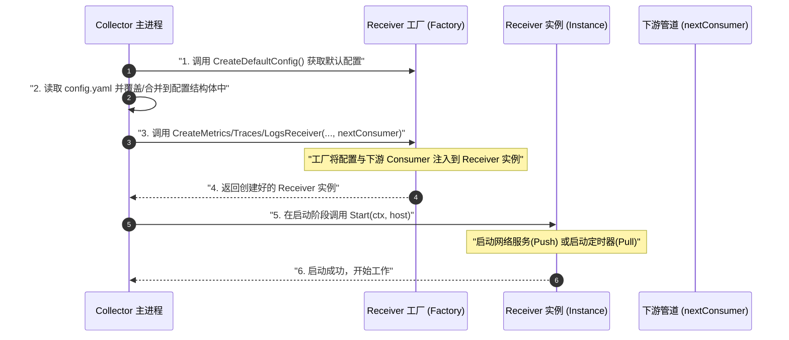

# OpenTelemetry Collector Receiver 执行流程与设计模式

本文件专注于 OpenTelemetry (OTel) Collector 的数据入口组件 —— **`Receiver` (接收器)**。文档将以实操和生产环境实例（`otlpreceiver` 与 `apachereceiver`）为线索，解析其内部设计模式和具体执行流程。

---

## 一、 Receiver 的核心角色与设计思想

在 OTel Collector 中，Receiver 扮演着**“数据门卫”**的角色。它的唯一职责是：**接收或采集外部的监控数据，将其转换为 Collector 内部的统一强类型数据结构 (`pdata`)，然后调用下游组件的接收函数传走。**

为了实现高度的插件化，Collector 框架对 Receiver 采用了**工厂模式** (Factory Pattern) 和 **依赖注入** (Dependency Injection) 的设计思想：
*   **配置 (Config)** 与 **实例 (Receiver)** 分离。
*   所有的 Receiver 必须通过一个统一的 **`Factory` (工厂)** 来创建。
*   下游的处理管道（例如下一个 Processor 或 Exporter）通过 **`Consumer` (消费者)** 接口注入到 Receiver 实例中。

---

## 二、 开发者视角：如何构建与初始化一个自定义 Receiver

如果你要为 Collector 增加一个新的数据源支持，你需要实现三个核心部分。以下是它们的执行和配合流程：

### 1. 定义配置结构体 (Config)
我们需要让用户在 `config.yaml` 中配置 Receiver。例如 `apachereceiver` 的配置：
```yaml
receivers:
  apache:
    endpoint: "http://localhost/server-status?auto"
    collection_interval: 10s
```
在 Go 代码中，会有一个对应的结构体映射这些字段：
```go
type Config struct {
    scraperhelper.ControllerConfig `mapstructure:",squash"`
    confighttp.ClientConfig        `mapstructure:",squash"`
}
```

### 2. 实现组件工厂 (Factory)
Factory 是 Receiver 注册到 Collector 的媒介。核心方法包括：
*   `NewFactory()`: 注册 Receiver 的唯一名称（如 `apache`）并绑定创建逻辑。
*   `CreateDefaultConfig()`: 规定配置的默认值（例如默认每 10 秒抓取一次）。
*   `CreateMetricsReceiver(ctx, settings, config, nextConsumer)`: 框架在启动时会调用此方法。
    *   **核心逻辑**：实例化你的 Receiver 结构体，并将下游的 **`nextConsumer`**（即下一个要处理数据的组件，实现了 `consumer.Metrics` 接口）作为参数传给你的 Receiver 实例。

### 3. 实现 Receiver 实例
你编写的 Receiver 结构体必须实现 `component.Component` 接口：
*   `Start(ctx, host)`: 当 Collector 启动时，框架自动调用该方法。在这里建立网络监听（Push 模式）或启动定时器（Pull 模式）。
*   `Shutdown(ctx)`: 当 Collector 停机时，框架自动调用。在这里释放连接、关闭端口。
*   **持有 `nextConsumer`**: 实例内部必须保存好工厂传进来的下游消费者，这样在收到数据后才能调用 `nextConsumer.ConsumeMetrics(ctx, pmetric)`。

---

### Custom Receiver 实例化与启动流程 (Mermaid)



---

## 三、 生产模式详解：Push（推）与 Pull（拉）执行流程对比

根据数据的获取方式，Receiver 分为两大流派。我们用生产环境最常用的两个实例来展示其详细的执行流程。

### 1. Push 模式：被动接收数据 (以 `otlpreceiver` 为例)

#### 生产场景：
微服务应用（如订单服务）内部集成了 OpenTelemetry SDK。当发生 API 调用时，SDK 会异步组装 Trace，通过 OTLP 协议推送到 Collector。

#### 执行流程：
1.  **启动**：框架调用 `otlpreceiver` 的 `Start()`。Receiver 启动一个 gRPC 服务和 HTTP 服务，监听并绑定端口 `4317` / `4318`。
2.  **等待连接**：服务端线程挂起，等待客户端连接。
3.  **接收数据**：订单微服务通过网络将数据发送过来。`otlpreceiver` 收到 Protobuf 格式的原始字节流。
4.  **数据转换**：gRPC/HTTP 处理器对字节流进行解码，并将其封装为 Go 语言强类型模型 `ptrace.Traces`。
5.  **派发下游**：调用 `nextConsumer.ConsumeTraces(ctx, ptrace)`。数据立刻离开 Receiver，进入下一个 Processor。
6.  **确认响应**：如果下游接收成功，Receiver 向微服务客户端返回 HTTP 200 或 gRPC OK 状态码；如果下游拥塞或出错，向客户端返回错误码以触发重试。

---

### 2. Pull 模式：主动抓取数据 (以 `apachereceiver` 为例)

#### 生产场景：
我们想监控 Apache 网页服务器的并发连接数和吞吐量。Apache 自身不会主动把指标发给 Collector，但它提供了一个监控状态页面 `http://localhost/server-status?auto`。

#### 执行流程：
1.  **启动**：框架调用 `apachereceiver` 的 `Start()`。Receiver 根据配置（例如 10秒 抓取一次），启动一个 Go `time.Ticker`（定时器）和后台监控协程 (Goroutine)。
2.  **定时器触发**：每过 10 秒，定时器向后台协程发送一个触发信号。
3.  **发起请求 (Scrape)**：Receiver 扮演 HTTP 客户端，向 `http://localhost/server-status?auto` 发送一个 HTTP GET 请求。
4.  **接收响应**：Apache 服务器返回包含监控指标的明文文本（如下所示）：
    ```text
    Total Accesses: 1024
    Total kBytes: 2048
    Uptime: 3600
    ReqPerSec: .284
    BusyWorkers: 5
    IdleWorkers: 10
    ```
5.  **数据转换**：Receiver 的解析模块读取这行文本，将 `BusyWorkers: 5` 等键值对解析出来，通过 metrics builder 组装成 OTel 标准的 `pmetric.Metrics` 数据结构。
6.  **派发下游**：调用 `nextConsumer.ConsumeMetrics(ctx, pmetric)` 将指标数据送入后续的加工流水线。

---

### Push 与 Pull 模式执行流程对比图 (Mermaid)

```mermaid
flowchart TD
    %% Push 模式分支
    subgraph Push ["Push 模式: otlpreceiver 实例"]
        A1["Start 被调用"] --> B1["启动 gRPC/HTTP Server (监听 4317/4318 端口)"]
        B1 --> C1["等待微服务推送数据"]
        C1 -->|"微服务发送 TCP 字节流"| D1["网络处理器接收并解码 Protobuf"]
        D1 --> E1["转换为 pdata.Traces 内部格式"]
        E1 --> F1["调用 nextConsumer.ConsumeTraces"]
        F1 --> G1["向微服务返回 HTTP 200 / gRPC OK"]
    end

    %% Pull 模式分支
    subgraph Pull ["Pull 模式: apachereceiver 实例"]
        A2["Start 被调用"] --> B2["启动 time.Ticker 定时器 (每 10 秒触发一次)"]
        B2 --> C2["定时信号到达"]
        C2 --> D2["扮演客户端向 Apache 发起 HTTP GET"]
        D2 -->|"接收 Apache 状态文本"| E2["解析文本键值对，转换为 pdata.Metrics"]
        E2 --> F2["调用 nextConsumer.ConsumeMetrics"]
    end

    %% 样式调整
    style Push fill:#fdf6e3,stroke:#b58900,stroke-width:2px;
    style Pull fill:#eee8d5,stroke:#586e75,stroke-width:2px;
```


